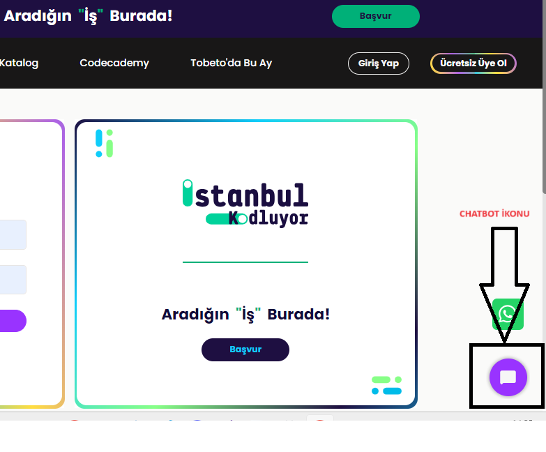
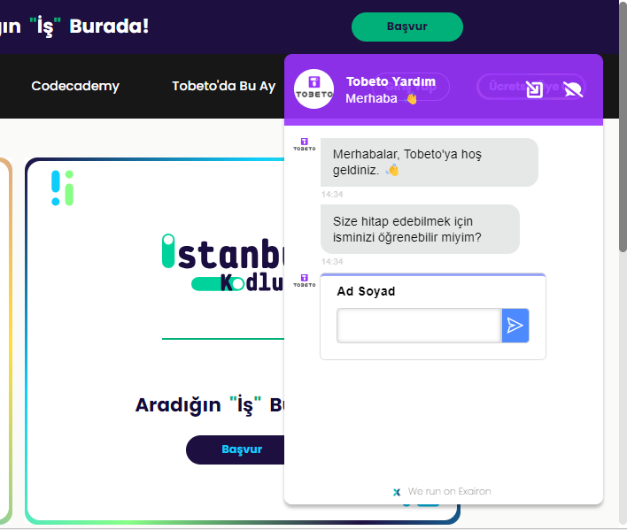
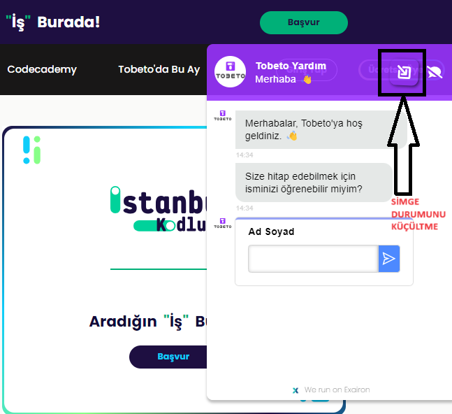
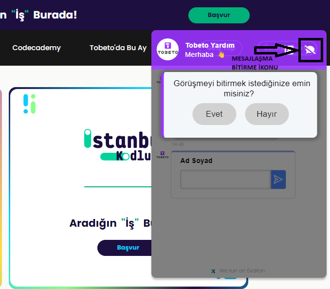
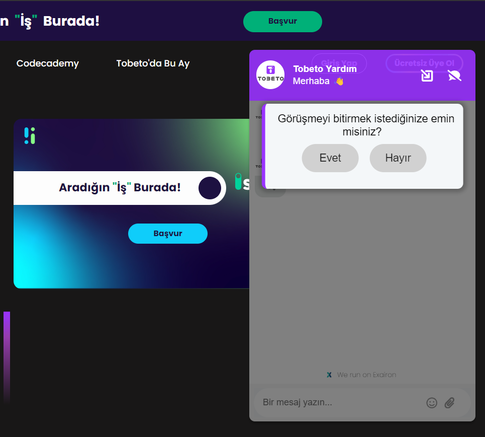
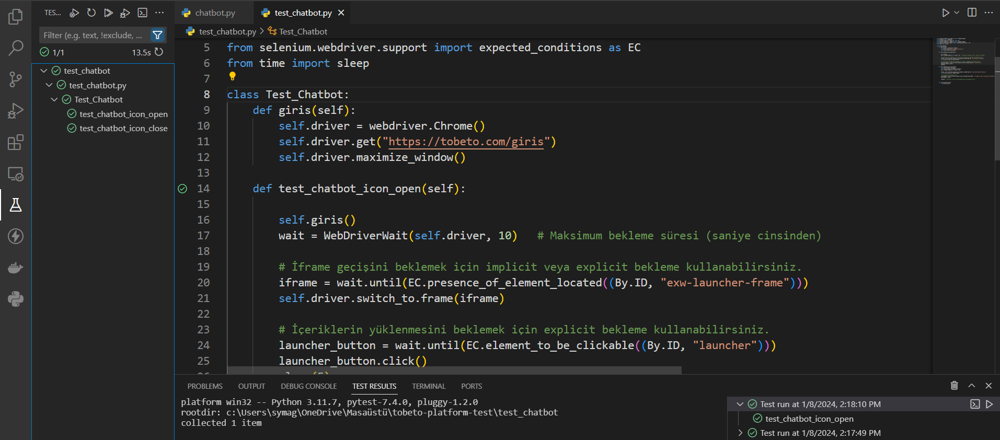

## Test Senaryo Adı: Chatbot kontrolü yapılacaktır.
#### Açıklama: Kullanıcının chatbot sistemini test etmek için oluşturulmuştur.
#### Ön Koşul: Kullanıcı https://tobeto.com/giris web sitesine erişmiş olmalıdır.
## Test Case 1: Yeni mesaj bölümü kontrolü
#### Adımlar:
#### 1. Chatbot butonuna tıklayın.
#### Beklenen sonuç:Ekranda açılır pencere şeklinde yeni bir mesaj bölümü açılmalıdır.

### Test Case 2: Mesaj bölümü kapama kontrolü
#### Ön Koşul: Mesaj bölümü açık olmalıdır.
#### Adımlar:
#### 1. Simge durumuna getir ikonuna tıklayın.
#### Beklenen Sonuç: Mesaj bölümü kapanmalıdır.

## Test Case 3: Uyarı Mesajı Kontrolü
#### Ön Koşul: Mesaj bölümü açık olmalıdır.
#### Adımlar:
#### 1. Mesajlaşmayı bitirme ikonuna tıklayın.
#### Beklenen Sonuç: Ekranda “Görüşmeyi bitirmek istediğinize emin misiniz?” Uyarı mesajı gözlenmelidir.

## Test Case 4: Puanlama Tablosu Kontrolü
#### Ön Koşul: Mesajlaşmayı bitirme ikonuna tıklanmış olmalıdır.
#### Adımlar:
#### 1) Görüşmeyi bitirmek istediğinize emin misiniz? Uyarı mesajında “Evet” butonuna tıklayın.
#### Beklenen Sonuç:Ekranda görüşme hakkında geri bildirim almak için mesaj ekranına puanlama tablosu gelmelidir.

##### Evet Butonu Tıklanmalı

## Test Case 4: Hayır Butonu Kontrolü
#### Ön Koşul: Mesajlaşma bitirme ikonuna basılmış olmalıdır.
#### Adımlar:
#### 1) Görüşmeyi bitirmek istediğinize emin misiniz? Uyarı mesajında “Hayır” butonuna tıklayın.
#### Beklenen Sonuç:Ekranda görüşmeye devam edeceğiniz mesajlaşma kısmı açık olmalıdır.Ekrana isim girilip konuşma devam ettirilebilmelidir.

##### Hayır Butonuna Tıklanmalı

## Chatbot Açma Kapama Pytest Kontrolü
