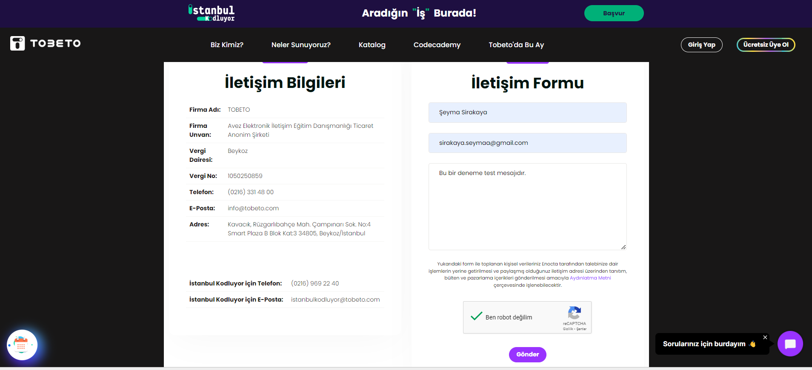
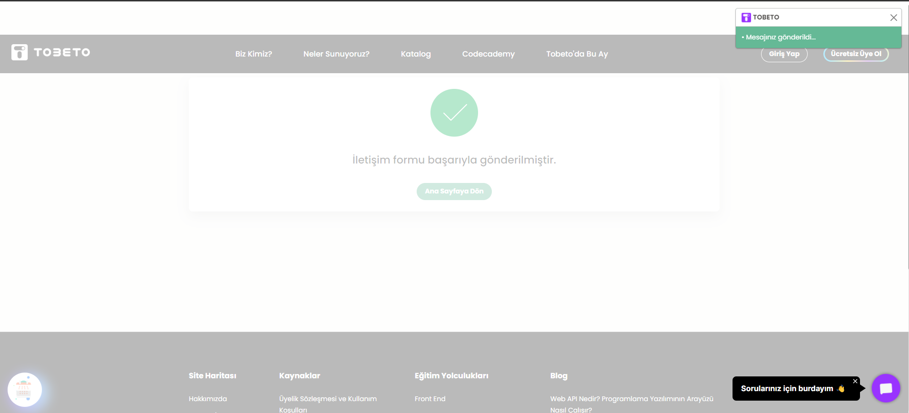
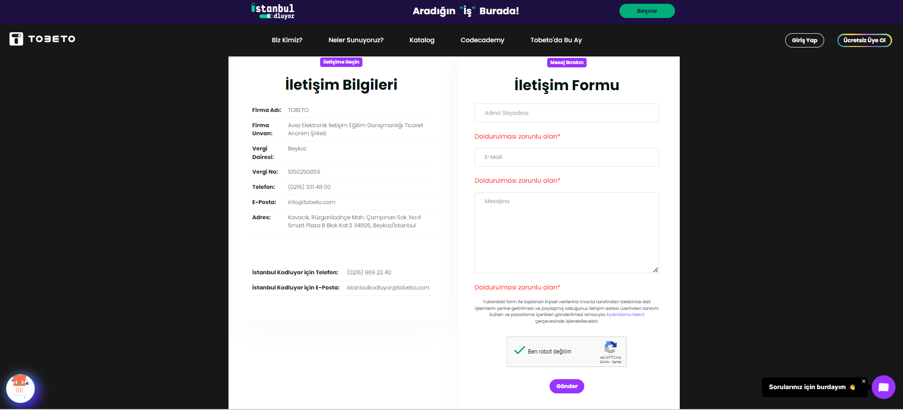
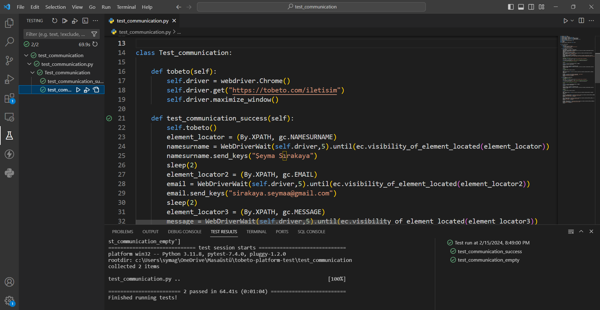

## Test Senaryosu: İletişim alanı kontrol edilecektir.
#### Açıklama: Kullanıcı iletişim için mesaj ve ileitişim kurabilmek için gerekli alanları kontrol edecektir.
#### Ön Koşul: https://tobeto.com/iletisim sayfasına erişilmiş olmalıdır.

## Test Case 1: İletişim için gerekli bölümlerin doldurulması test edilecektir.
#### Adımlar:
#### 1- Adınız ve Soyadınız alanını doldurun.
#### 2- E-mail alanını doldurun.
##### Data: abc@gmail.com
#### 3- Mesaj alanınını doldurun.
#### 4- Recaptha alanını işaretleyin.
#### 5- Gönder butonuna tıklayın.
#### Beklenen Sonuç: Mesajınız gönderildi... şeklinde uyarı mesajı gelmelidir. İletişim formu başarıyla gönderildi ekranına yönlendirilmelidir.

   
## Test Case 2: İletişim için gerekli bölümlerin boş bırakılması test edilecektir.
#### Adımlar:
#### 1- Adınız ve Soyadınız alanını boş bırakın.
#### 2- E-mail alanını boş bırakın.
#### 3- Mesaj alanınını boş bırakın.
#### 4- Recaptha alanını işaretleyin.
#### 5- Gönder butonuna tıklayın.
#### Beklenen Sonuç: Doldurulması zorunlu alanların altında "Doldurulması zorunlu alan*" şeklinde uyarı mesajı gelmelidir. 

 

## PYTEST KONTROLÜ 

 
