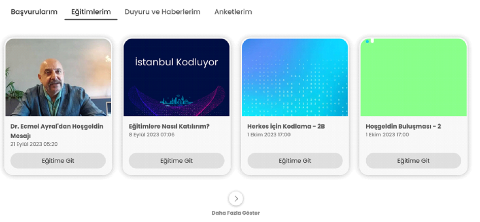
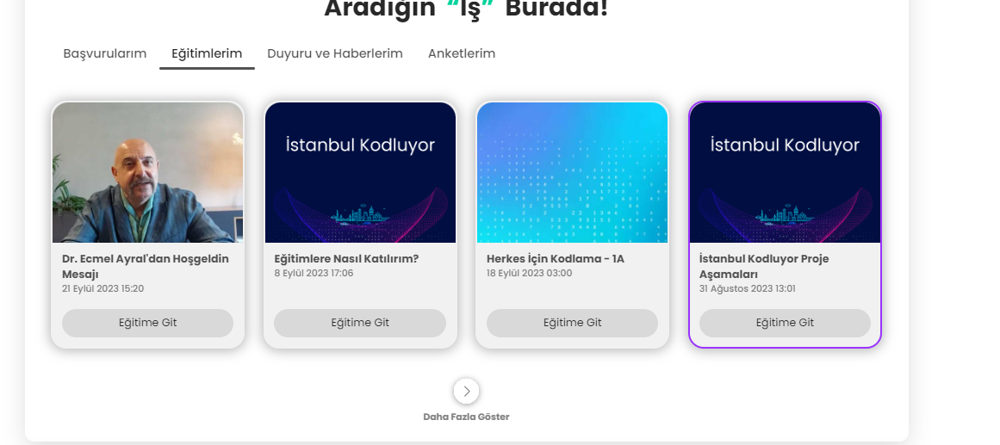
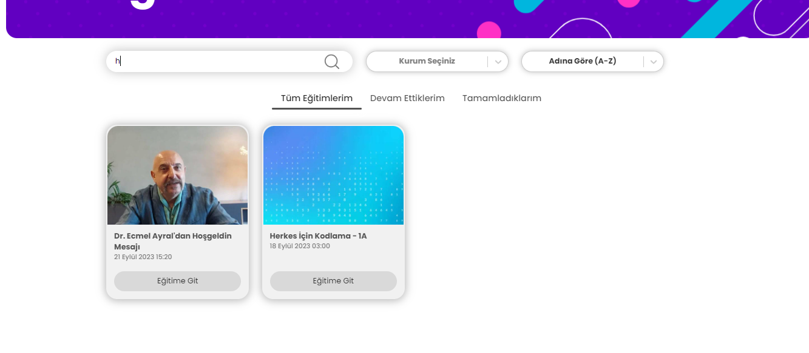
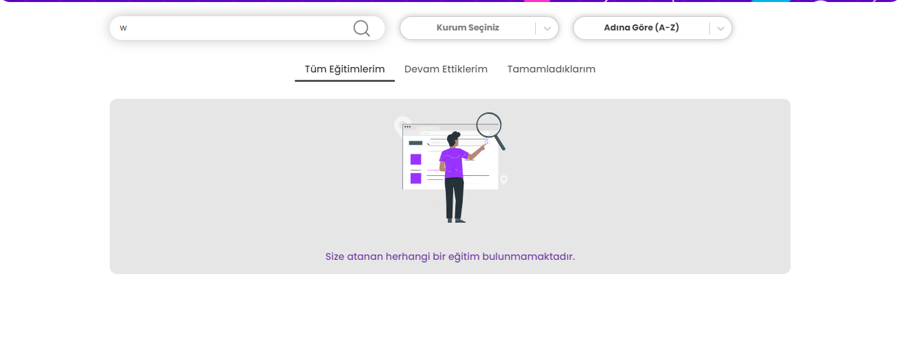
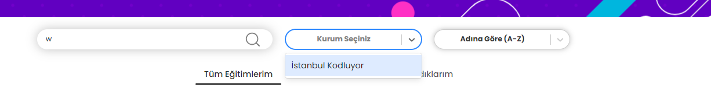
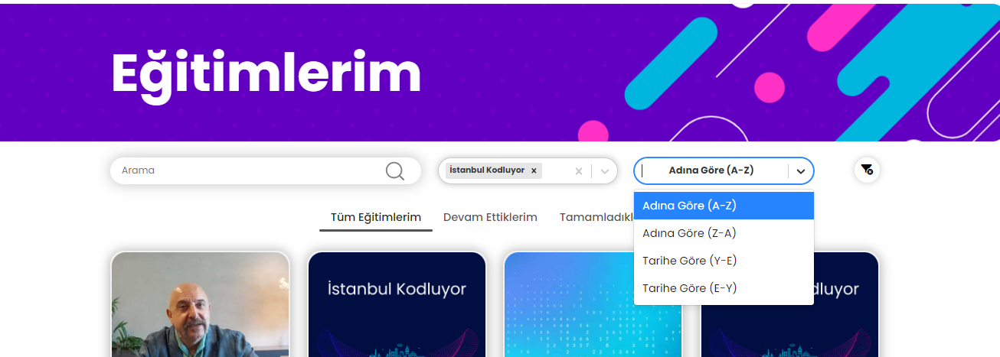
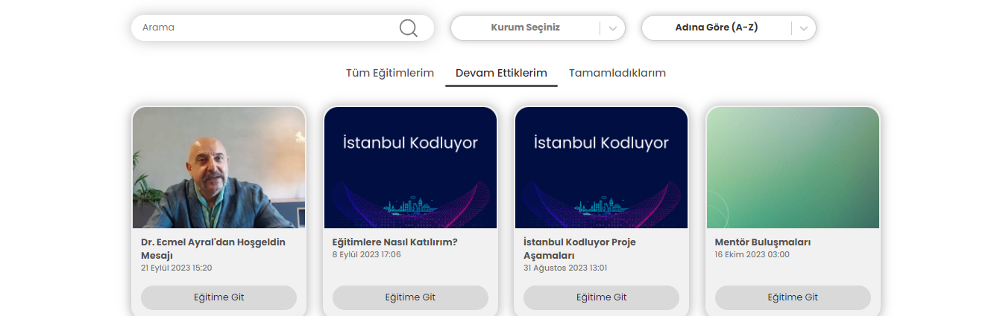
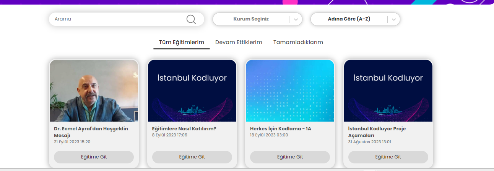
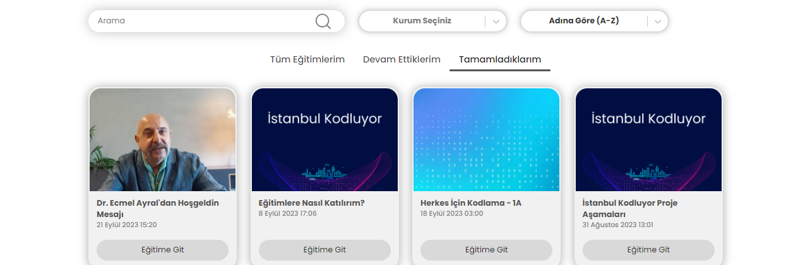
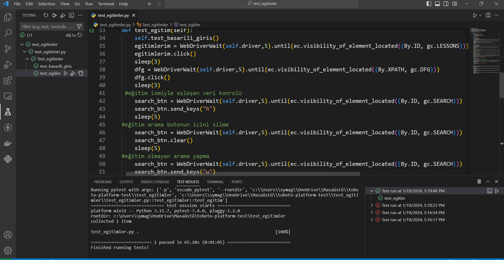

## Test Senaryosu: Eğitimlerim bölümünun kontrolü yapılacaktır.
#### Açıklama: Kullanıcının ‘Eğitimlerim’ butonuna tıkladığında kendisine tanımlanan eğitimleri görebilmesi ve tanımlı olan eğitimlere tıkladığında ilgili eğitim sayfasına yönlendirilmesi durumunu  kontrol etmek için oluşturulmuştur.
#### Ön koşul:  https://tobeto.com/giris sayfasına erişilmiş olmalıdır.

## Test Case :
#### Adımlar :
#### 1.Call test >> test_giris >> test1
#### 2.’Eğitimlerim’ sekmesine tıklayın
#### Beklenen sonuç: Kullanıcı kendisine tanımlanan eğitimleri max. 4 adet olacak şekilde görüntüleyebilmelidir.

 
#### 3.’Daha fazla göster ‘ butonuna tıklayın.
#### Beklenen sonuç : Kullanıcı ‘Eğitimlerim’ sayfasına yönlendirilmeli ve eğitimler adına göre baştan son alfabetik sıralama olacak şekilde listelenmeli ve varsayılan olarak ‘Tüm Eğitimlerim’ sekmesi görüntülenmelidir.

 

#### 4. Arama çubuğuna eğitim isimleri ile eşleşen veri girin
#### Data: ‘h’
#### Beklenen sonuç : Girilen karakterle eşleşen eğitimler eş zamanlı listelenmeli.

#### 5.arama çubuğuna  eğitim isimleri ile eşleşmeyen veri girin
#### Data : ‘w’
#### Beklenen sonuç :”Size atanan herhangi bir eğitim bulunmamaktadır.” yazısı görüntülenmelidir.

#### 6.Sayfayı yenileyin.
#### Beklenen sonuç: Eğitimler arama ayarları sıfırlanmış şekilde görüntülenmeli(default)

#### 7. “Kurum seçiniz” arama çubuğuna tıklayın.
#### Beklenen sonuç: Eğitimleri veren kurumların adı açılır listede görüntülenmeli ve karakter girişi yapabildiğimi gösteren imleç yanıp sönmeli.

#### 8.Filtreleme çubuğundan kurum seçimi yapınız.
#### Beklenen sonuç: Eş zamanlı olarak yalnızca seçilen kurumun verdiği eğitimler listelenmeli ve arama çubuğunda seçilen kurumun ismi görüntülenmeli.

#### 9.Sayfayı yenileyin
#### Beklenen sonuç: eğitimler filtreleme ayarları sıfırlanmış şekilde görüntülenmeli
#### 10.Sıralama çubuğunun üzerine tıklayın.
#### Beklenen sonuç: Açılır listede neye göre seçenek yapılmak istenildiğini belirten seçenekler bulunmalıdır.

#### 11."Adına göre (Z-A)" seçeneğine tıklayın
#### Beklenen sonuç: Eğitimler alfabetik sıraya göre sondan başa sıralanmalıdır.
#### 12."Adına göre (A-Z)" seçeneğine tıklayın
#### Beklenen sonuç: Eğitimler alfabetik sıraya göre baştan sona sıralanmalıdıtr.
#### 13. "Tarihe göre (Y-E) " seçeneğine tıklayın
#### Beklenen sonuç: Eğitimler tarihe göre yeniden eskiye olacak şekilde sıralanmalıdır.
#### 14."Tarihe göre (E-Y) "seçeneğine tıklayın
#### Beklenen sonuç: Eğitimler tarihe göre eskiden yeniye olacak şekilde sıralanmalıdır.

#### 15. "Devam Ettiklerim" başlık sekmesine tıklayın
#### Beklenen sonuç: Başlık altında seçilen sekmeye göre yer değiştirebilen çizgi olmalı ve devam edilmekte olan eğitimler görüntülenmeli

#### 16."Tüm Eğitimlerim" başlık sekmesine tıklayın.
#### Beklene sonuç: Tıklanan Başlık altında seçilen sekmeye göre yer değiştirebilen çizgi olmalıdır. 

#### 17. "Tamamladıklarım" başlık sekmesine tıklayın
#### Beklenen sonuç: Başlık altında seçilen sekmeye göre yer değiştirebilen çizgi olmalı ve tamamlanan eğitimler görüntülenmelidir.

#### 18. Görüntülenen eğitimlerden herhangi birinin altındaki ‘Eğitime Git’ butonuna tıklayın.
#### Beklenen sonuç:Açılan sayfadaki eğitimin tamamlanma yüzdesi 100 olmalıdır. 

## PYTEST KONTROLÜ 

