## Test Senaryosu 1: Senkron Eğitim Panelinin Kontrolü
#### Açıklama: Tobeto eğitim platformunda kullanıcıların seknron ve asenkron eğitimlere erişimi kontrol edilecektir.
#### Ön Koşul: Kullanıcının tobeto eğitim platformuna giriş yapmış olmalı ve eğitimlerin atanmış olması gerekmektedir.

## Test Case 1: Senkron Eğitimlerin Görüntülenmesi 
#### Adımlar:
#### 1.	“Eğitimlerim” butonuna tıklayın.
#### 2.	Senkron eğitim içeriğine tıklayın.
#### Beklenen sonuç: Kullanıcı senkron eğitim sayfasına erişmelidir.
 
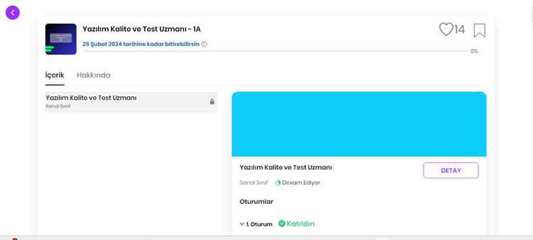

## Test Case 2: Eğitimlerde Beğeni Simgesi Kontrolü
#### Adımlar:
#### 1.	Eğitim içeriğine girin.
#### 2.	Renksiz gözüken kalp butonuna tıklayın.
#### Beklenen Sonuç: Kalp butonu kırmızı renge dönüşmeli ve beğeni sayısı görünmelidir.
#### 3.	Kalp butonuna tekrar tıklayın.
#### Beklenen Sonuç: Kalp butonu rengi kırmızından renksiz renge dönmelidir.

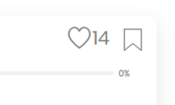

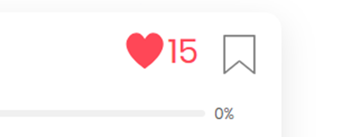

## Test Case 3: Eğitimleri Beğenen Kişilerin Görüntülenmesi
#### Adımlar:
#### 1.	Eğitimin kalp butonunun yanındaki sayı kısmına tıklayın.
#### Beklenen Sonuç: Eğitimi beğene kişilerin adı ve soyadı gözükmeli birden fazla sayfadaki kişi sayıları gözlemlenmeli.

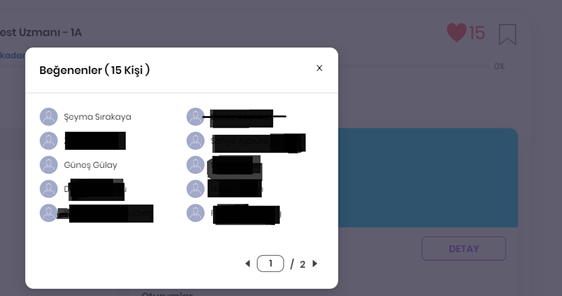

 
## Test Case 4: Senktron Eğitim İçerik, Hakkında ve Ödev Kısımlarının Kontrolü
#### Ön Koşul: Kullanıcı “Eğitimlerim” bölümüne girmiş olmalıdır.
#### Adımlar: 
#### 1.	Hakkında alanına tıklayın.
#### Beklenen Sonuç: Kullanıcı beklenen eğitim hakkında başlangıç ve bitiş tarihi , geçirdiği süreyi ve kategorisini görüntüleyebilmelidir.

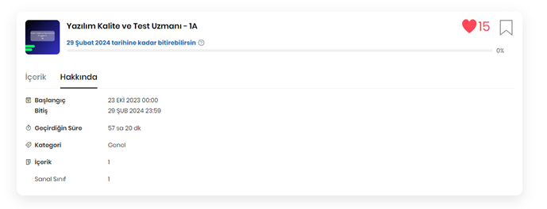

#### 2.	İçerik alanına tıklayın.
#### Beklenen sonuç: Kullanıcı eğitim ismi ve sınıf adının yazılı olduğu ve bu alanla ilgili eğitim oturum bilgileri alanı bulunmalıdır. Eğitim içerik alanında eğitim görseli, eğitimin adı , eğitmenlerin adı , eğitim devam durumu , oturum listesi ve detay butonu görüntülenmelidir.
#### Oturumlar alt alta olacak şekilde oturum sırasına göre istelenmelidir. Oturun sırasının yanında oturum tarihi, oturum katılım bilgisi ve oturumun gerçekleşmesine bağlı değişen oturumu görüntüleme butonu yer almalıdır.

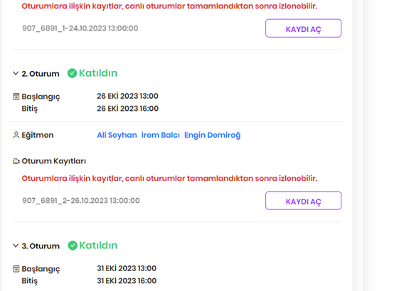

#### 3. Kaydı aç butonuna tıklayın.
#### Beklenen Sonuç: Kullanıcı daha önceden dahil olduğu kaydı açabilmeli tekrar izleyebilmelidir.
 
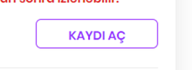
 
## Test Case 5: Senkron Eğitim Katıl Butonu Kontrolü
#### Adımlar:
#### 1.	Katıl butonuna tıklayın.
#### Beklenen Sonuç: Eğitim başlamışssa katıl butonu aktif olmalı ve tıklanabilmelidir.
#### Eğer eğitim başlamamışsa katıl butonu pasif olmalıdır.

## Test Case 6: Ödev Sekmesi Kontrolü
#### Adımlar: 
#### 1.	Kullanıcı ödev sekmesine tıklayabilmelidir.
#### Beklenen sonuç: Ödevin adı, notu , tamamlama durumu ve “Detay” butonu görüntülenmelidir.
 
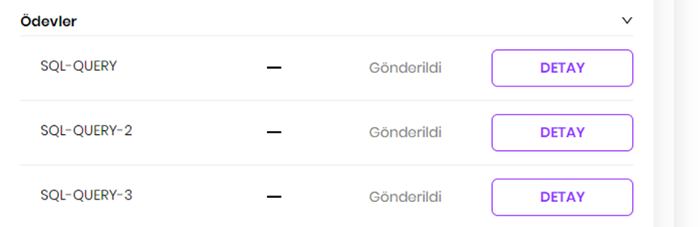

## Test Case 7: Detay Butonu Kontrolü
#### Adımlar:
#### 1.	Call Test >> Test Case 6
#### 2.	“Detay” butonuna tıklayın.
#### Beklenen Sonuç: Açıklama, gönderilen dosyalar, ödev açıklaması başlıkları bulunmalı. 

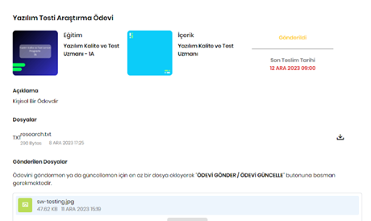

#### 3.	Dosya Ekle butonuna tıklayın.
#### Beklenen Sonuç: Kullanıcı belirtilen formatta dosya seçip ekleyebilmelidir.
#### 4.	Ödev Açıklama ksmına tıklayın. 
#### Beklenen Sonuç: kullanıcı ödevle ilgili veri girişi yapabilmelidir.
#### 5. “Ödevi Güncelle” butonuna tıklayın.
#### Beklenen Sonuç: Ödev güncellenebilmeli ve tekrar kaydedilebilmelidir.

------------------------------------------------------------------------ 

## Test Senaryosu 2: Asenkron Eğitim Panelinin Kontrolü
#### Açıklama: Tobeto eğitim platformunda kullanıcıların seknron ve asenkron eğitimlere erişimi kontrol edilecektir.
#### Ön Koşul: Kullanıcının tobeto eğitim platformuna giriş yapmış olmalı ve eğitimlerin atanmış olması gerekmektedir.

## Test Case 1: Asenkron Eğitimlerin Görüntülenmesi 
#### Adımlar:
#### 1. “Eğitimlerim” butonuna tıklayın.
#### 2.	Asenkron eğitim içeriğine tıklayın.
#### Beklenen sonuç: Kullanıcı asenkron eğitim sayfasına erişmelidir.
 
 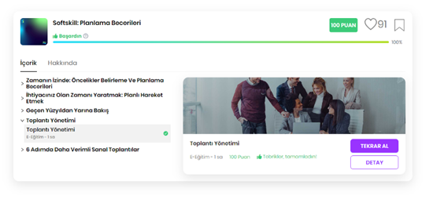

## Test Case 2: Eğitimlerde Beğeni Simgesi Kontrolü
#### Adımlar:
#### 1. Eğitim içeriğine girin.
#### 2.	Renksiz gözüken kalp butonuna tıklayın.
#### Beklenen Sonuç: Kalp butonu kırmızı renge dönüşmeli ve beğeni sayısı görünmelidir.
#### 3.	Kalp butonuna tekrar tıklayın.
#### Beklenen Sonuç: Kalp butonu rengi kırmızından renksiz renge dönmelidir.

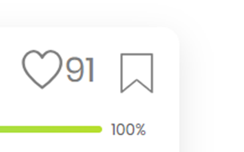

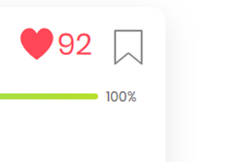

## Test Case 3: Eğitimleri Beğenen Kişilerin Görüntülenmesi
#### Adımlar:
#### 1.	Eğitimin kalp butonunun yanındaki sayı kısmına tıklayın.
#### Beklenen Sonuç: Eğitimi beğene kişilerin adı ve soyadı gözükmeli birden fazla sayfadaki kişi sayıları gözlemlenmeli.
 
   

## Test Case 4: Asenktron Eğitim İçerik, Hakkında ve Ödev Kısımlarının Kontrolü
#### Ön Koşul: Kullanıcı “Eğitimlerim” bölümüne girmiş olmalıdır.
#### Adımlar: 
#### 1. İçerik alanına tıklayın.
#### Beklelen Sonuç: İlk eğitime dair eğitim videosu görünmelidir. Eğitime ait konu başlıkları , simge ve bu alanla ilişkili eğitim videosunu içeren alan bulunmalıdır. Video içeriğinde geçirilen süre başlanmamışsa “Başlamadın”, yarıda kaldıysa “Devam Ediyor”, ve bittiyse “Tebrikler , tamamladın” mesajları görüntülenmeli.
 
 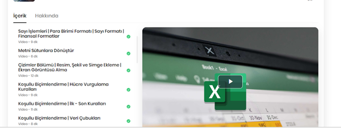
 
 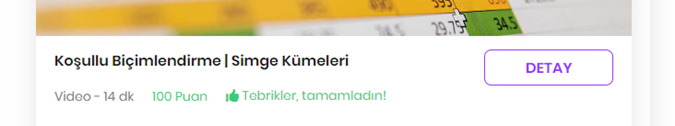

 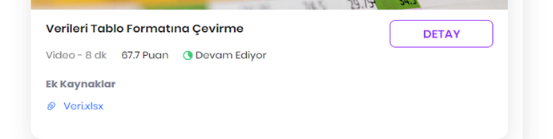

 

#### 2.	Hakkında alanına tıklayın.
#### Beklenen Sonuç: Kullanıcı beklenen eğitim hakkında başlangıç ve bitiş tarihi, geçirdiği süreyi ve kategorisini ve üreticii firmayı görüntüleyebilmelidir.
 
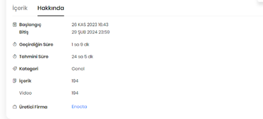

## SENKRON PYTEST KONTROLÜ

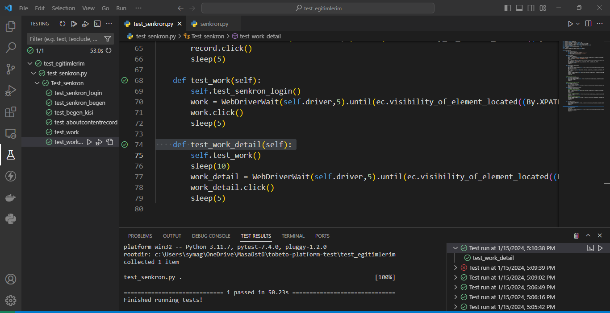

## ASENKRON PYTEST KONTROLÜ

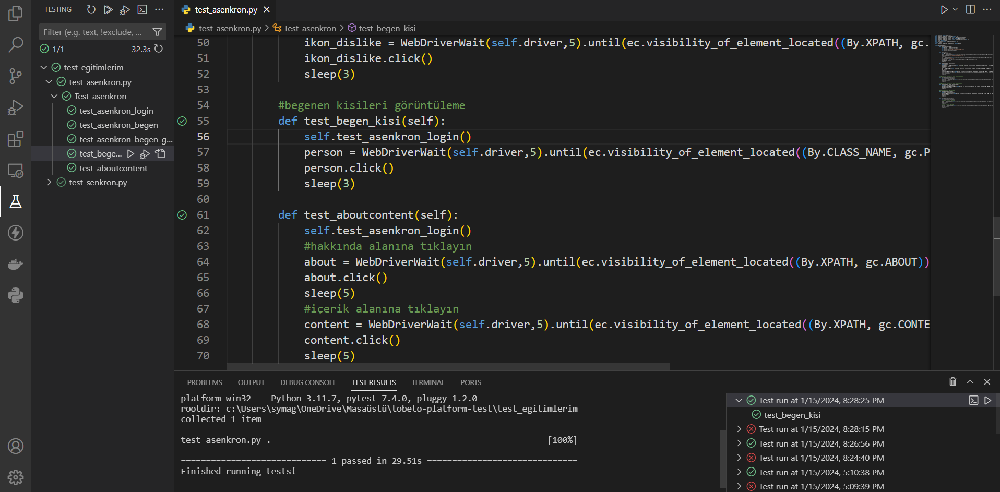
