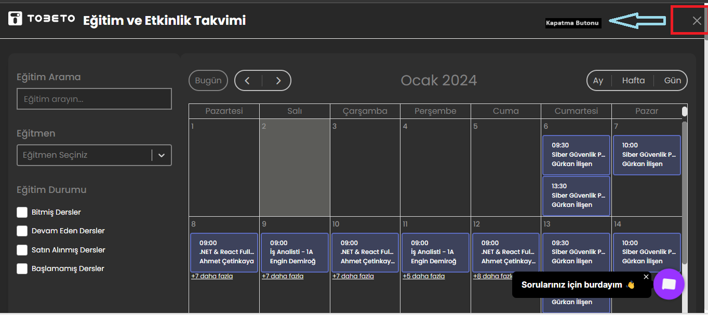

## Test Senaryo Adı: Takvim Kontrolü Yapılacaktır.
### Açıklama: Kullanıcının takvim sistemini test etmek için oluşturulmuştur.
### Ön Koşul:  https://tobeto.com/ web sitesine erişmiş olmalıdır.

### Test Case 1: Eğitim ve Etkinlik Sayfasının Erişim Kontrolü
#### Adımlar:
#### 1-) Sayfada yer alan eğitim ve etkinlik butonuna tıklayın.

### Beklenen Sonuç:Ekranda "Eğitim ve Etkinlik Takvimi" sayfasına erişebilmelidir.

### Test Case 2: Eğitim ve Etkinlik Takvimi sayfasının kapatılması kontrolü
#### Ön Koşul: Eğitim ve Etkinlik Takvimi sayfası açık olmalıdır.
#### Adımlar:
#### 1-) Kapat simgesine tıklayın.

#### Beklenen Sonuç:Kullanıcı https://tobeto.com/ sayfasına yönlendirilmelidir.

## PYTEST KONTROLÜ 
