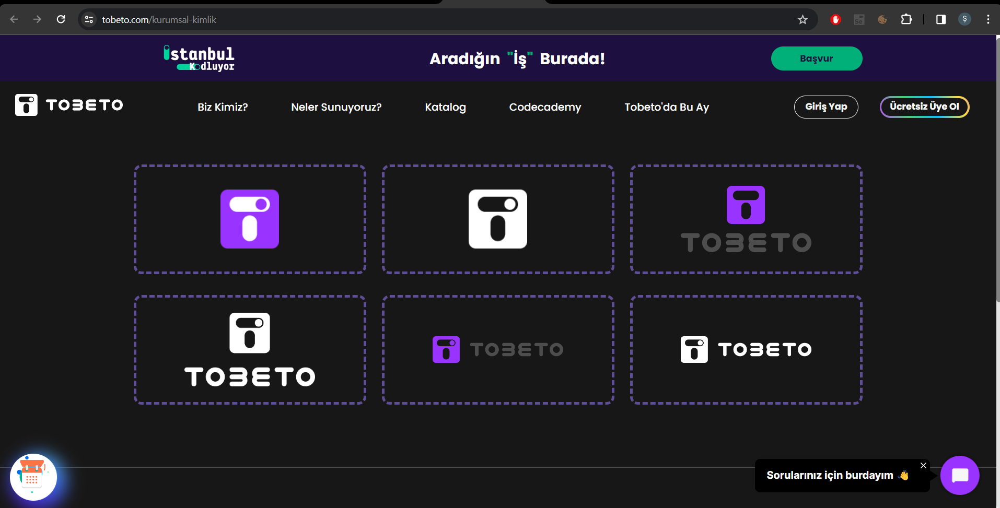

## Test Senaryosu : tobeto.com sayfasının alt bilgi bölümü kontrolü yapılacaktır. 
#### Açıklama : tobeto.com url adresine girildiğinde gözlemlenen alt bilgi ekranı kontrol edilecektir. 
#### Ön koşul : tobeto.com sayfasına eirşmiş olmalıdır.

## Test Case: Site Haritası, Kaynaklar, Eğtiim Yolculukları alanlarının alt başlıkları test edilecektir.
#### Adımlar:
#### 1. Sayfanın alt bilgi bölgesine sayfayı kaydırın.

#### 2. Site haritası altında 'Hakkımızda' alanına tıklayın.
#### Beklenen Sonuç: https://tobeto.com/hakkimizda sayfasına erişilmiş olunmalıdır.

#### 3. Site haritası altında 'Bireyler İçin' alanına tıklayın.
#### Beklenen Sonuç: https://tobeto.com/bireyler-icin sayfasına erişilmiş olunmalıdır.

#### 4. Site haritası altında 'Kurumlar İçin' alanına tıklayın.
#### Beklenen Sonuç: https://tobeto.com/kurumlar-icin sayfasına erişilmiş olunmalıdır.

#### 5. Site haritası altında 'Kurumsal Kimlik' alanına tıklayın.
#### Beklenen Sonuç: https://tobeto.com/kurumsal-kimlik sayfasına erişilmiş olunmalıdır.

#### 6. Site haritası altında 'S.S.S' alanına tıklayın.
#### Beklenen Sonuç: https://tobeto.com/sss sayfasına erişilmiş olunmalıdır.

#### 7. Site haritası altında 'İletişim' alanına tıklayın.
#### Beklenen Sonuç: https://tobeto.com/iletisim sayfasına erişilmiş olunmalıdır.

#### 8. Kaynaklar altındaki 'Üyelik Sözleşmesi ve Kullanım Koşulları' alanına tıklayın.
#### Beklenen Sonuç: https://tobeto.com/yasal-metinler/tobeto-uyelik-sozlesmesi sayfasına erişilmiş olmalıdır.

#### 9. Kaynaklar altındaki 'KVKK Aydınlatma Metni' alanına tıklayın.
#### Beklenen Sonuç: https://tobeto.com/yasal-metinler/kvkk-aydinlatma-metni sayfasına erişilmiş olmalıdır.

#### 10. Kaynaklar altındaki 'İlgili Kişi Başvuru Formu' alanına tıklayın.
#### Beklenen Sonuç: https://tobeto.s3.cloud.ngn.com.tr/Tobeto_Ilgili_Kisi_Basvuru_Formu_b0f79d29ba.pdf dosyasına erişilmiş olmalıdır.

#### 11. Kaynaklar altındaki 'Çerez Politikası' alanına tıklayın.
#### Beklenen Sonuç: https://tobeto.com/yasal-metinler/tobeto-cerez-politikasi sayfasına erişilmiş olmalıdır.

#### 12. Kaynaklar altındaki 'Cayma Formu' alanına tıklayın.
#### Beklenen Sonuç: https://tobeto.s3.cloud.ngn.com.tr/v_Cayma_Formu_6bc3a888a3.pdf dosyasına erişilmiş olmalıdır.

#### 13. Eğitim Yolculukları altındaki 'Front End' alanına tıklayın.
#### Beklenen Sonuç: https://tobeto.com/programlar/frontend sayfasına erişilmiş olmalıdır.

 

#### 14. Eğitim Yolculukları altındaki 'Full Stack' alanına tıklayın.
#### Beklenen Sonuç: https://tobeto.com/programlar/full-stack-developer sayfasına erişilmiş olmalıdır.

 

#### 15. Eğitim Yolculukları altındaki 'Web & Mobile' alanına tıklayın.
#### Beklenen Sonuç: https://tobeto.com/programlar/web-mobile sayfasına erişilmiş olmalıdır.

 

#### 16. Eğitim Yolculukları altındaki 'Veri Bilimi' alanına tıklayın.
#### Beklenen Sonuç: https://tobeto.com/yakinda sayfasına erişilmiş olmalıdır.

 

#### 17. Eğitim Yolculukları altındaki 'Siber Güvenlik' alanına tıklayın.
#### Beklenen Sonuç: https://tobeto.com/yakinda sayfasına erişilmiş olmalıdır.

 

#### 18. Eğitim Yolculukları altındaki 'UI / UX' alanına tıklayın.
#### Beklenen Sonuç: https://tobeto.com/yakinda sayfasına erişilmiş olmalıdır.

 

## PYTEST KONTROLÜ

 