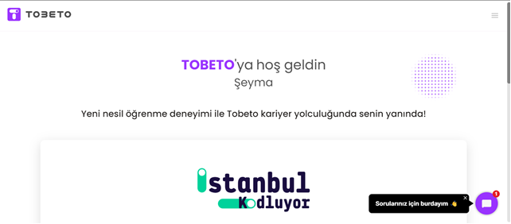
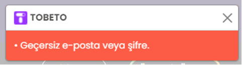
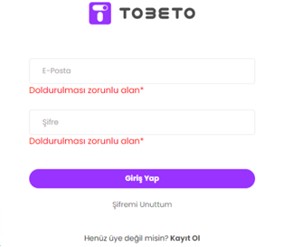
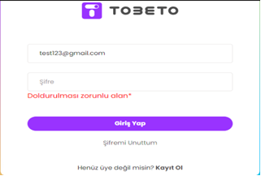
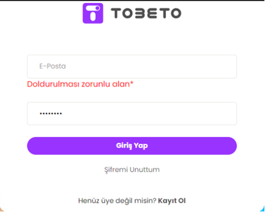

### https://tobeto.com/giris ekranının selenyum testi

## Test Senaryosu 1: Kullanıcıların sisteme giriş kontrolü yapılacaktır.
#### Açıklama: Kullanıcıların sisteme başarılı/başarısız giriş yapabilme durumunu test etmek için oluşturulmuştur.
#### Ön Koşul: Web ‘de ” https://tobeto.com/giris” sayfası açık olmalıdır.

### Test Case-1: Successful kullanıcı giriş kontrolü.
#### Açıklama: Kullanıcının sisteme giriş yapabilme işleminin doğrulanması amacıyla oluşturulmuştur.
#### Doğru e-posta ve şifre ile sisteme giriş yapabilmesi test edilecektir.
#### Ön koşul: Kullanıcının login olabileceği bir test hesabı olmalıdır. 
#### Adımlar:
#### 1-) E-posta alanını doldurun.
####  Input: test123@gmail.com
#### 2-) Şifre alanını doldurun.
####  Input: test123
#### 3-) Giriş Yap butonuna tıklayın.
#### Beklenen Sonuç: Kullanıcı başarılı bir şekilde sisteme giriş yapmalı ve anasayfaya yönlendirilmeli.

### Test Case-2: Unsuccessful kullanıcı giriş kontrolü.
#### Açıklama: Kullanıcının sisteme giriş yapabilme işleminin doğrulanması amacıyla oluşturulmuştur.
#### Yanlış e-posta ve şifre ile sisteme giriş yapabilmesi test edilecektir.
#### Adımlar:
#### 1-) E-posta alanını doldurun.
####  1.1-) Input: abc@gmail.com (geçersiz e-posta)
####  1.2-) Input: test123gmail.com (geçerli e-posta)
       
#### 2-) Şifre alanını doldurun.
####  2.1-) Input: abc123 (geçersiz şifre)
####  2.2-) Input: abc123 (geçersiz şifre)

#### 3-) Giriş Yap butonuna tıklayın.
#### Beklenen Sonuç: Ekranda “Geçersiz e-posta veya şifre” uyarısı görülmelidir.

### Test case 3: Boş bırakılan alanlara göre başarısız kullanıcı giriş kontrolü.
#### Açıklama: E-posta ve şifre alanlarının boş bırakılarak sisteme giriş yapabilmesi test edilecektir.
#### Adımlar:
#### 1.	E-posta alanını doldurun.
####  1.1.	Input:  boş bırakın
####  1.2.	Input: test123@gmail.com (geçerli e-posta)
####  1.3.	Input:  boş bırakın
#### 2. Şifre alanını doldurun.
####  2.1.	Input:  boş bırakın
#### 2.2.	Input:  boş bırakın
####  2.3.	test123 (geçerli şifre)
#### 3. Giriş Yap butonuna tıklayın.
#### Beklenen sonuç: Boş bırakılan alanın altından ‘Doldurulması zorunlu alan*’ uyarısı görüntülemelidir.

## PYTEST KONTROLÜ 

