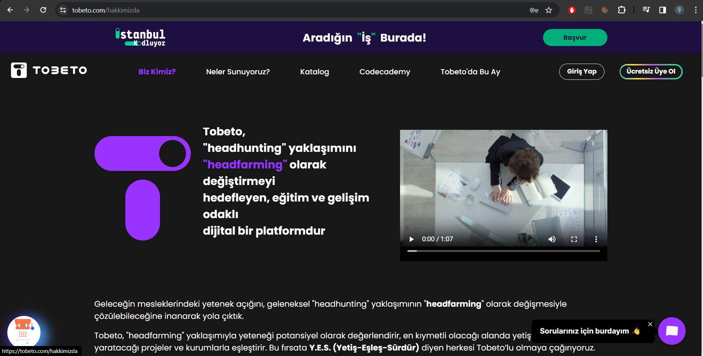
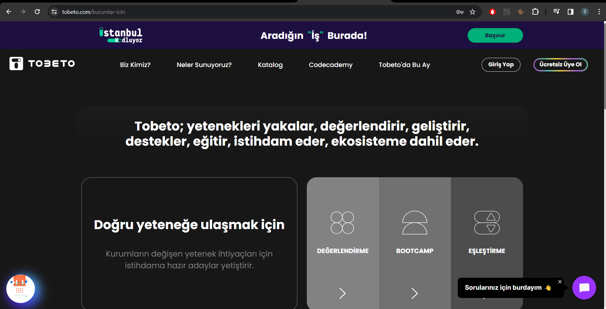
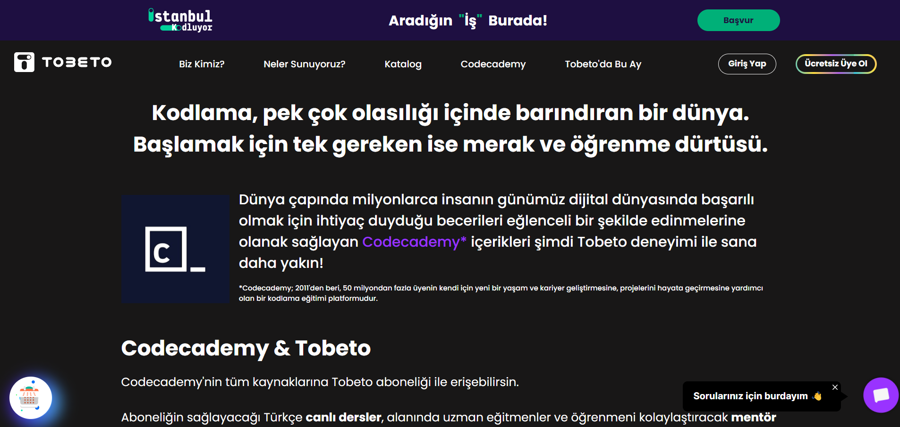
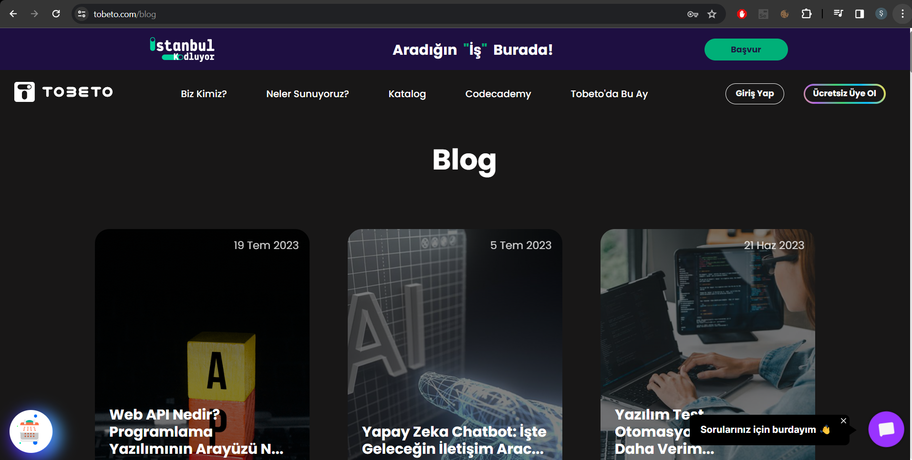
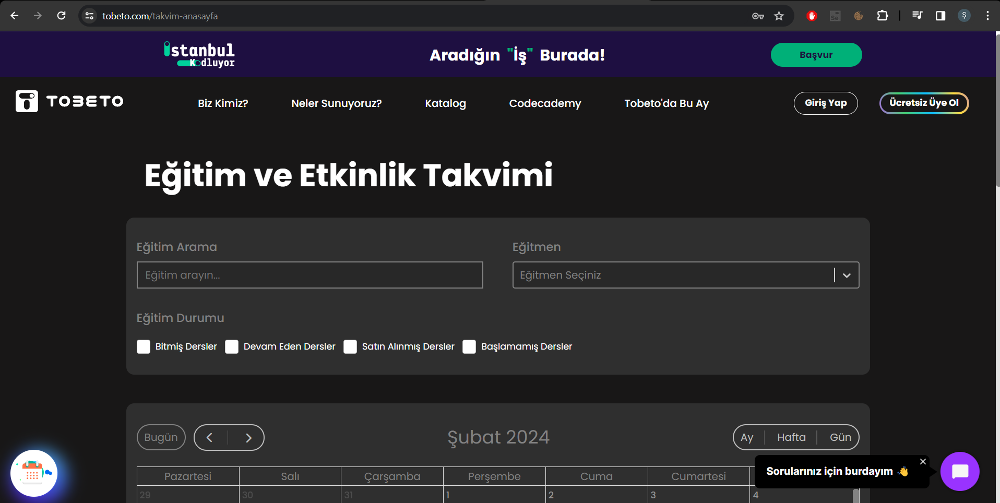
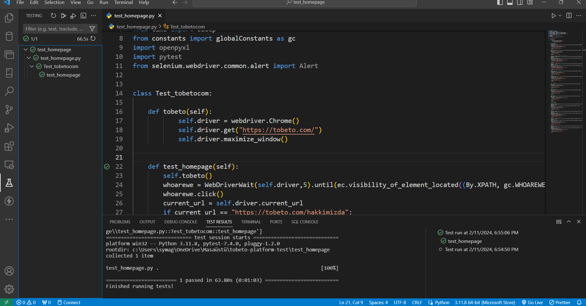

<h1>Test Senaryosu : tobeto.com sayfası kontrolü yapılacaktır. </h1>>
<b> Açıklama : tobeto.com url adresine girildiğinde gözlemlenen ekran kontrol edilecektir. </b> 
<b> Ön koşul : Kullanıcı tobeto.com sayasına eirşmiş olmalıdır.  </b> 

<h2>Test Case: TOBETO , Biz Kimiz?, Neler Sunuyoruz?, Katolog , Codecademy , Tobeto'da Bu Ay , Başvur, Giriş Yap ve Ücretsiz Üye Ol kısımları test edilecektir.</h2> 
 Adımlar:  
  1- Biz Kimiz alanına tıklayın. 
 Beklenen Sonuç: https://tobeto.com/hakkimizda sayfasına erişilmelidir.  
  
 2- TOBETO logosuna tıklayın. 
 Beklenen Sonuç: https://tobeto.com/ ana sayfasına geri dönmelidir. 
  
 3- Neler Sunuyoruz? alanına tıklayın. 
 3.1- Bireyler için alanını seçin.  
 Beklenen Sonuç: https://tobeto.com/bireyler-icin sayfasına erişilmelidir. 
  
 3.2- Kurumlar için alanına tıklayın. 
 Beklenen Sonuç: https://tobeto.com/kurumlar-icin sayfasına erişilmelidir. 
  
 4- Katolog alanına tıklayın. 
 Beklenen Sonuç: https://tobeto.com/katalog sayfasına erişilmelidir. 
  
 5- Codecademy alanına tıklayın. 
 Beklenen Sonuç: https://tobeto.com/codecademy sayfasına erişilmelidir. 
  
 6- Giriş Yap butonuna tıklayın. 
 Beklenen Sonuç: https://tobeto.com/giris sayfasına erişilmelidir. 
  
 7- Ücretsiz Üye Ol alanına tıklayın. 
 Beklenen Sonuç: https://tobeto.com/kayit-ol sayfasına erişilmelidir. 
  
 8- Başvur alanına tıklayın. 
 Beklenen Sonuç: https://tobeto.com/istanbul-kodluyor sayfasına erişilmelidir. 
  
 9- Tobeto'da Bu Ay alanına tıklayın. 
 9.1- Blog alanına tıklayın. 
 Beklenen Sonuç: https://tobeto.com/blog sayfasına erişilmelidir. 
  
 9.2- Basında Biz alanına tıklayın. 
 Beklenen Sonuç: https://tobeto.com/basinda-biz sayfasına erişilmelidir. 
  
 9.3- Takvim alanına tıklayın. 
 Beklenen Sonuç: https://tobeto.com/takvim-anasayfa sayfasına erişilmelidir. 
  
 9.4- İstanbul Kodluyor alanına tıklayın. 
 Beklenen Sonuç: https://tobeto.com/istanbul-kodluyor sayfasına erişilmelidir. 
  

## PYTEST KONTROLÜ 

