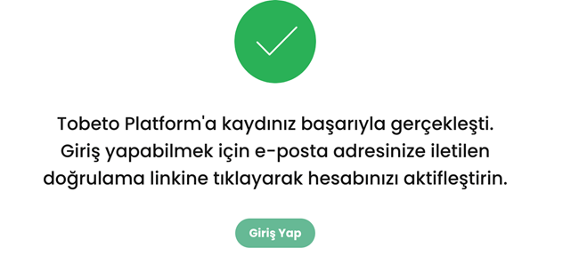

## Test senaryosu 2: Kullanıcının siteye kayıt olabilmesi durumu doğrulanacaktır.
### Açıklama: Kullanıcının başarılı/başarısız kayıt olma durumlarının kontrol edilmesi amacıyla oluşturulmuştur.
### Ön koşul: Web’de  “https://tobeto.com/kayit-ol” sayfası açık olmalıdır.
### Test case 1: Kullanıcının sisteme başarıyla kayıt olma durumu kontrol edilecektir.
### Ön koşul: Kullanıcının sistemde kayıtlı hesabı olmamalıdır.
### Adımlar:
- 1.Ad alanını doldurun.
 * Input: tested
- 2.Soyad alanını doldurun.
 * Input: testsoyad
- 3.E-posta alanını doldurun.
 * Input: test456@hotmail.com (kayıtlı olmayan e_posta hesabı)
- 4.Şifre alanını doldurun
 * Input:test456
- 5.Şifre tekrarı alanını doldurun.
 * Input: test456
- 6. Kayıt ol butonuna tıklayın
- 7. ‘Açık Rıza Metni’ni okudum ve anladım.* ‘ onay kutusunu işaretleyin
- 8. 'Üyelik Sözleşmesi ve Kullanım Koşulları’nı okudum ve anladım.*’ onay kutusunu işaretleyin.
- 9. E-posta gönderim izni.* onay kutusunu işaretleyin
- 10. Arama izni.* onay kutusunu işaretleyin
- 11. en az 10 haneli olacak şekilde geçerli bi telefon numarası girin
 * Input: 5355353535
- 12. ‘Ben robot değilim’ reCAPTCHA onay kutusunu işaretleyin
- 13. ‘Devam Et ‘ butonuna tıklayın.
Beklenen sonuç: Kullanıcı kaydının başarılı olduğunu gösteren bir ekrana yönlendirilmelidir.

