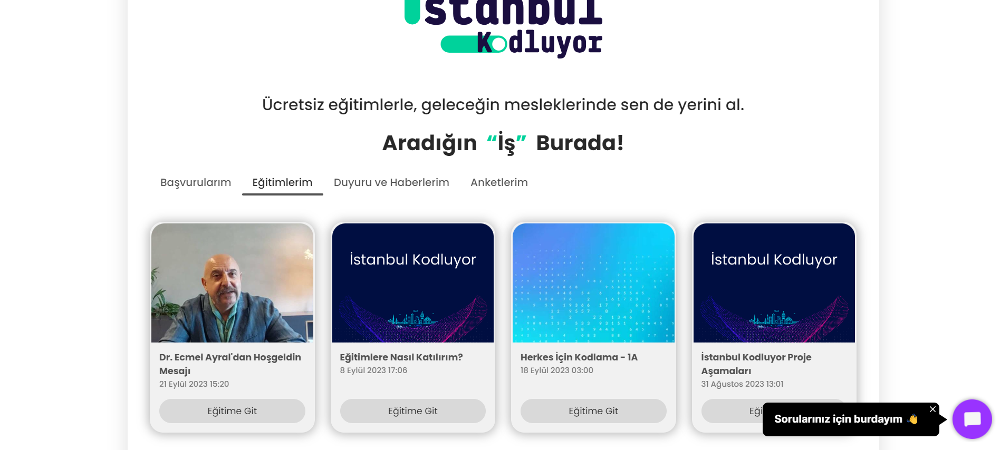
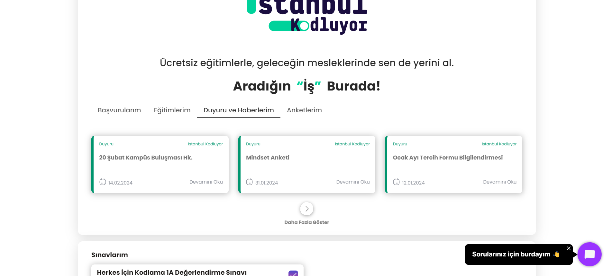
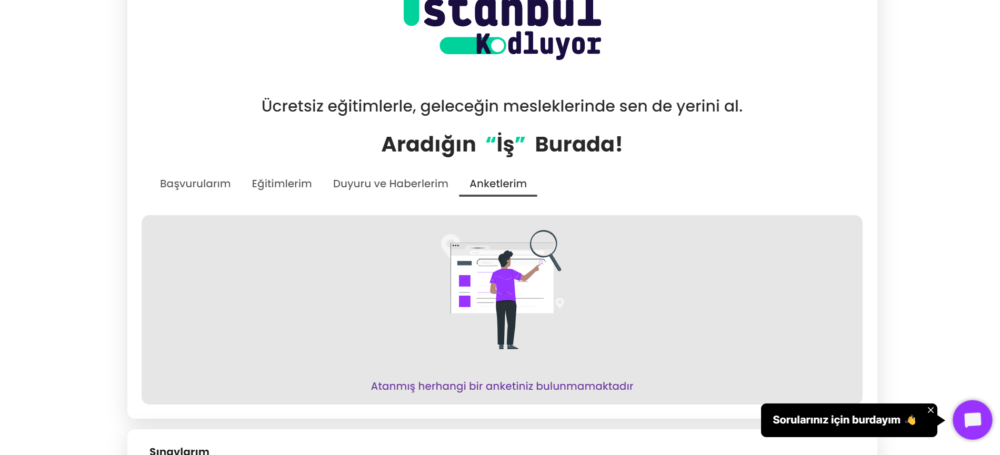
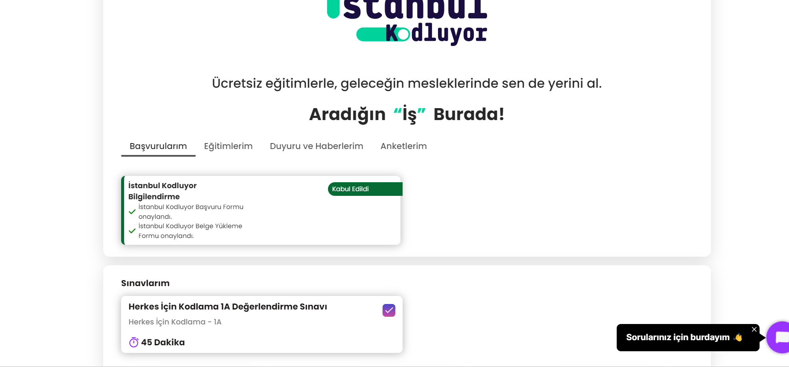

## Test Senaryosu: Platform kısmı kontrol edilecektir.
#### Açıklama: Kullanıcının platform üzerinde yer alan kısımlara erişimi kontrol edilecektir.
#### Ön Koşul: Kullanıcının giriş yapmış olması gerekmektedir. 

## Test Case : Eğitimler, Duyuru ve Haberlerim, Anketlerim, Basvuru alanları kontrol edilecektir.
#### Adımlar :
#### 1- Eğitimler alanına tıklayın.
#### Beklenen Sonuç: Kullanıcı eğitimler alanını görüntüleyebilmelidir.

#### 2- Duyuru ve Haber alanına tıklayın.
#### Beklenen Sonuç: Kullanıcı Duyuru ve Haber alanını görüntüleyebilmelidir.

#### 3- Anketler  alanına tıklayın.
#### Beklenen Sonuç: Kullanıcı anketler alanını görüntüleyebilmelidir.

#### 4- Başvurularım  alanına tıklayın.
#### Beklenen Sonuç: Kullanıcı başvuru alanını görüntüleyebilmelidir.

## PYTEST KONTROLÜ 

