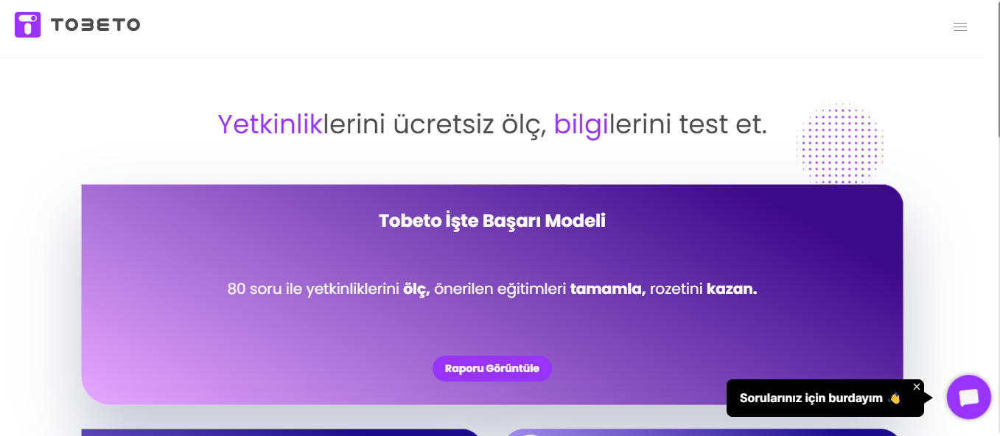
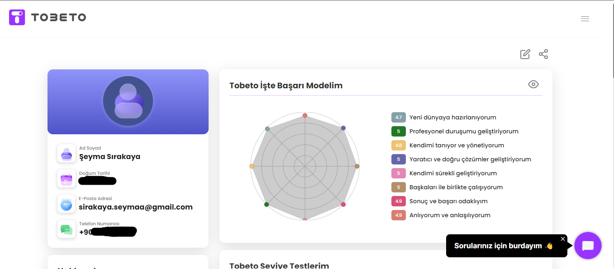
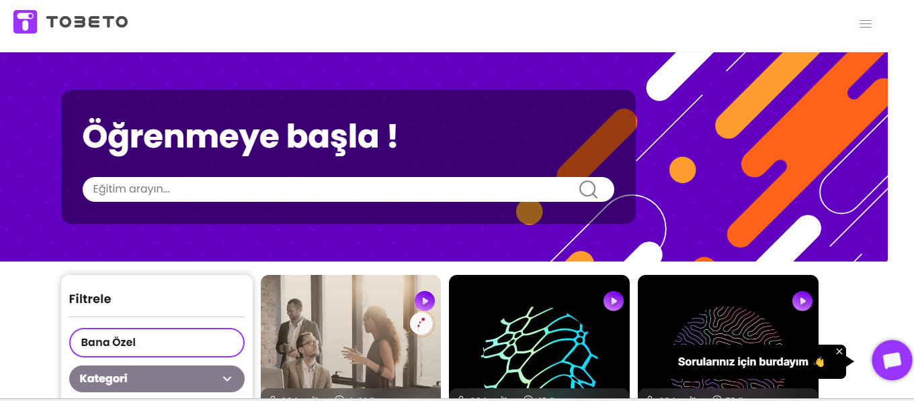
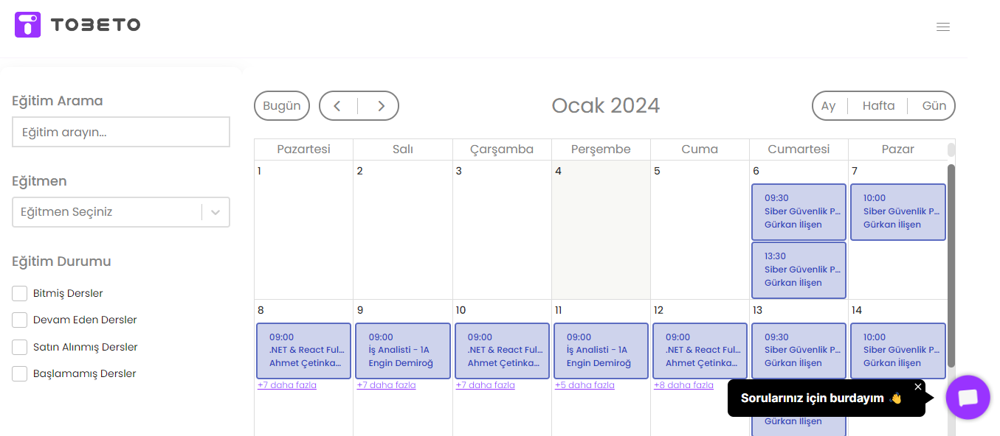
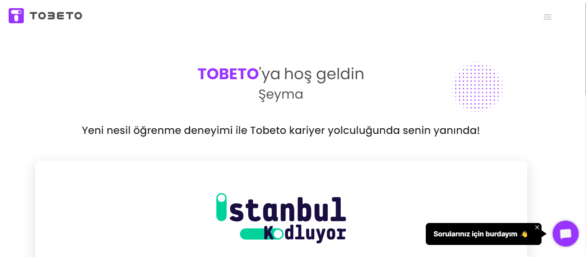
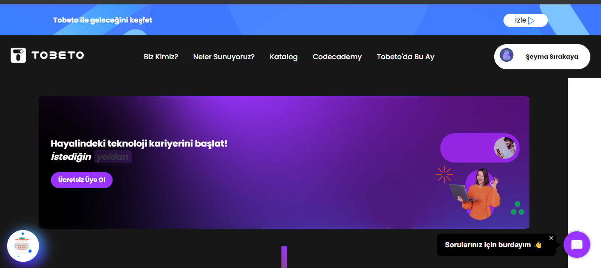
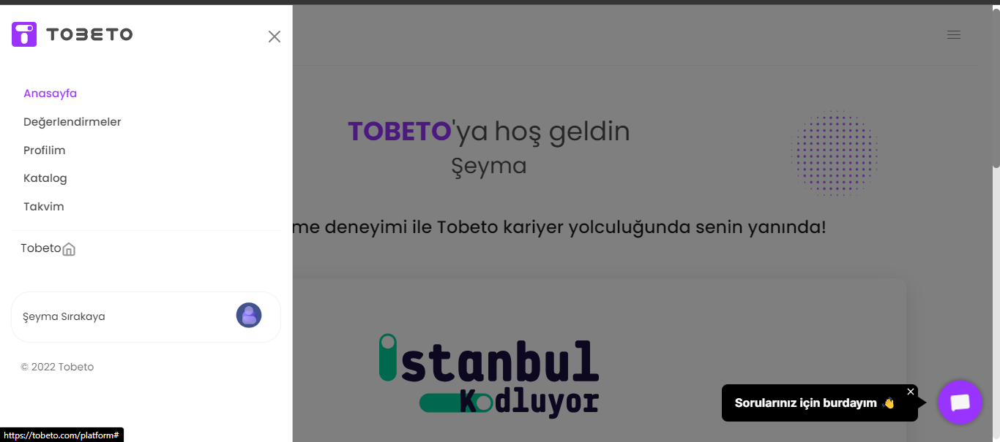

## Test Senaryosu: Kullanıcının web sitesinde bulunan menü barda yer alan içeriklerin görüntülenmesi kontrol edilecektir.
#### Açıklama: Kullanıcının web sitesinde bulunan sayfa başlıklarını görüntülemesi ve sayfada gezilebilmesi test etmesi için oluşturulmuştur.
#### Ön Koşul: https://tobeto.com/platform web sitesine erişilmiş olmalıdır. Test edilebilir kullanıcı hesabına giriş yapılmış olmalıdır.

## Test Case 1: TOBETO logosuna tıklama test edilecektir.
#### Adımlar:
#### 1. Ekranı sol üstünde bulunan TOBETO logusuna tıklayın.
#### Beklenen Sonuç: Ana sayfadan farklı bir sayfadaysa eğer kullanıcı TOBETO logosuna tıkladığında ana sayfaya yönlendirilmelidir.

 
## Test Case 2: TOBETO menüsündeki öğelere tıklama test edilecektir.
#### Adımlar:
#### 1. https://tobeto.com/platform sayfasına girin.
#### 2. "Değerlendirmeler" yazısına tıklayın.
####    Beklenen Sonuç: Kullanıcı Değerlendirmeler sayfasına yönlendirilmelidir.

#### 3."Profilim" yazısına tıklayın.
####    Beklenen Sonuç: Kullanıcı Profil sayfasına yönlendirilmelidir.

#### 4. "Katalog" yazısına tıklayın.
####    Beklenen Sonuç: Kullanıcı Katalog sayfasına yönlendirilmelidir.

#### 5. "Takvim" yazısına tıklayın.
####    Beklenen Sonuç: Kullanıcı Takvim sayfasına yönlendirilmelidir.

#### 6. "Anasayfa" yazısına tıklayın.
#### Beklenen Sonuç: Kullanıcı Ana sayfaya yönlendirilir.

#### 7. En altta yer alan "Tobeto" yazısına tıklayın.
####    Beklenen Sonuç: Kullanıcı "https://tobeto.com/" sayfasına yönlendirilmelidir.

##### Beklenen Sonuç: Kullanıcı tüm sayfalara yönlendirilmeli ve sayfalar arası geçiş yapabilmelidir. 

