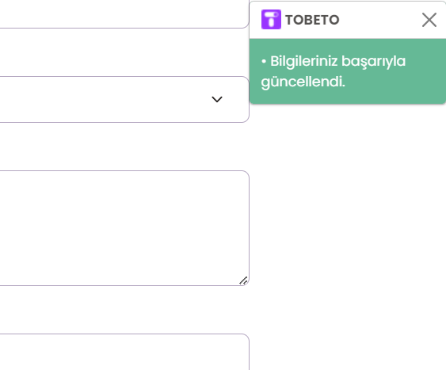
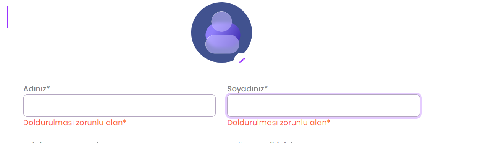

## Test Senaryosu: Kullanıcının profil bilgilerini eklenmesi test edilecektir.
#### Açıklama: Kullanıcının isim, soyisim, tc, telefon, adres ve hakkında bilgilerinin kontrol edilmesi amacıyla oluşturulmuştur.
#### Ön Koşul: Kullanıcı Tobeto platformuna giriş yapmış olmalıdır.

## Test Case 1: Kullanıcının istenilen bilgileri doldurması kontrol edilecektir.
#### Adımlar : 
#### 1.Adınız alanını doldurun.
####  Input: Şeyma
#### 2.Soyadınız alanını doldurun.
####  Input: Sırakaya
#### 3.Telefon Numaranız alanını doldurun.
####  Input: 555 111 99 88
#### 4.Dogum Tarihiniz alanını doldurun
####  Input:21.07.1998
#### 5.Tc Kimlik No alanını doldurun.
####  Input: 32190947118
#### 6.Ülke adı girin.
#### Input: Türkiye
#### 7.İl seçin.
#### 8. İlçe seçin.
#### 9. Mahalle/Sokak girin.
#### Input: Misket Mahallesş 610 Sokak
#### Hakkımda alanını doldurun.
#### Kaydet butonuna basın.
#### Beklenen Sonuç: Kullanıcı başarıyla bilgilerini kaydetmeli ve "• Bilgileriniz başarıyla güncellendi." penceresi çıkmalıdır.

## Test Case 2: Kullanıcının istenilen bilgileri doldurmaması kontrol edilecektir.
#### Adımlar:
#### 1.Kullanıcı tüm alanları boş bırakmalıdır.
#### 2.Kullanıcı kaydet butonuna basmalıdır.
#### Beklenen Sonuç : * görünen inputların altında "Doldurulması zorunlu alan*" şeklinde kırmızı bir metin gözlemlenmelidir. 

## PYTEST KONTROLÜ 

