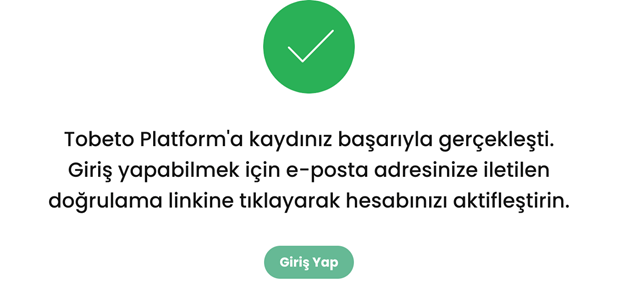
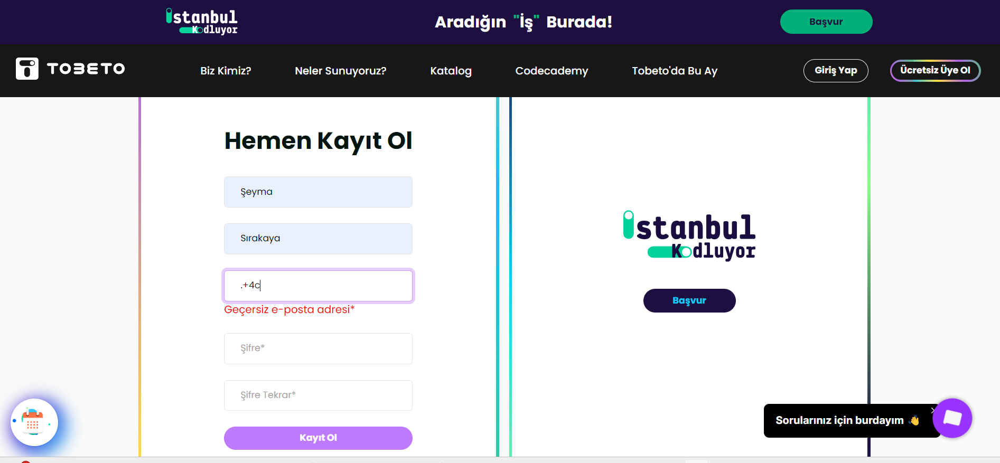
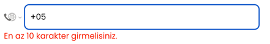
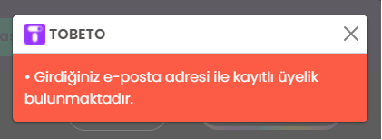
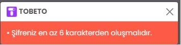
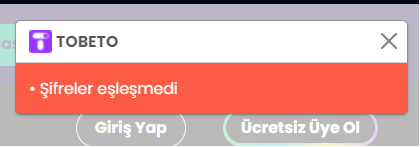
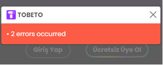
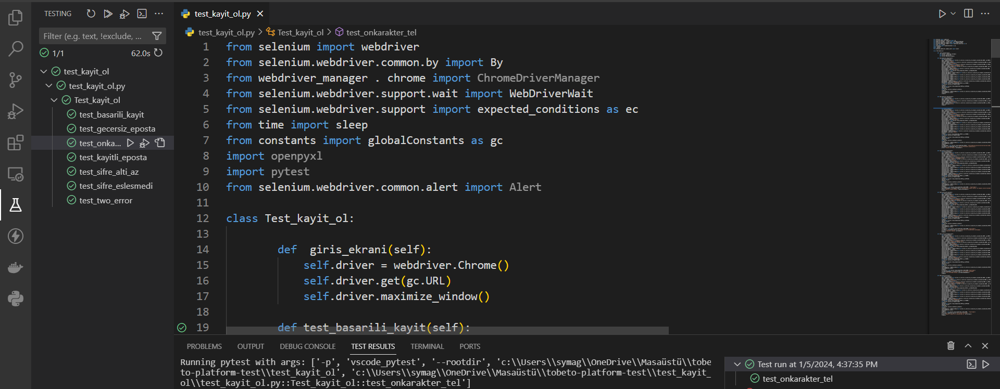

## Test senaryosu 2: Kullanıcının siteye kayıt olabilmesi durumu doğrulanacaktır.
#### Açıklama: Kullanıcının başarılı/başarısız kayıt olma durumlarının kontrol edilmesi amacıyla oluşturulmuştur.
#### Ön koşul: Web’de  “https://tobeto.com/kayit-ol” sayfası açık olmalıdır.

## Test case 1: Kullanıcının sisteme başarıyla kayıt olma durumu kontrol edilecektir.
#### Ön koşul: Kullanıcının sistemde kayıtlı hesabı olmamalıdır.
#### Adımlar:
#### 1.Ad alanını doldurun.
####  Input: Şeyma
#### 2.Soyad alanını doldurun.
####  Input: Sırakaya
#### 3.E-posta alanını doldurun.
####  Input: seymasirakaya@gmail.com (kayıtlı olmayan e_posta hesabı)
#### 4.Şifre alanını doldurun
####  Input:123456
#### 5.Şifre tekrarı alanını doldurun.
####  Input: 123456
#### 6. Kayıt ol butonuna tıklayın
#### 7. ‘Açık Rıza Metni’ni okudum ve anladım.* ‘ onay kutusunu işaretleyin
#### 8. 'Üyelik Sözleşmesi ve Kullanım Koşulları’nı okudum ve anladım.*’ onay kutusunu işaretleyin.
#### 9. E-posta gönderim izni.* onay kutusunu işaretleyin
#### 10. Arama izni.* onay kutusunu işaretleyin
#### 11. en az 10 haneli olacak şekilde geçerli bi telefon numarası girin
####  Input: 5355353535
#### 12. ‘Ben robot değilim’ reCAPTCHA onay kutusunu işaretleyin
#### 13. ‘Devam Et ‘ butonuna tıklayın.
####  Beklenen sonuç: Kullanıcı kaydının başarılı olduğunu gösteren bir ekrana yönlendirilmelidir.

## Test case 2: Kullanıcının geçersiz E-Posta kullanarak sisteme kayıt olma işlemi test edilecektir.
#### Ön Koşul : Geçersiz e-posta adresi e-posta formatında olmamalıdır. 
#### Adımlar:
#### 1.Ad alanını doldurun.
####  Input: Şeyma
#### 2.Soyad alanını doldurun.
####  Input: Sırakaya
#### 3.E-posta alanını doldurun.
####  Input:abc.+4 (geçersiz e-posta adresi)
####  Input:e (geçersiz e-posta adresi)
####  Input: günes (geçersiz e-posta adresi)
#### 4.Şifre alanını doldurun
####  Input:123456
#### 5.Şifre tekrarı alanını doldurun.
####  Input: 123456
#### 6. Kayıt ol butonuna tıklayın
#### Beklenene sonuç: Kullanıcı E-posta adresi alanını doldurulmaya başlandığında geçerli bir e-posta adresi yazana kadar kutucuğun altında kırmızı renkte “Geçersiz e-posta adresi*” uyarısı görünmelidir.

## Test Case 3: Telefon Numarasının 10 karakterden az girilerek kayıt olma durumu kontrol edilecektir.
#### Ön Koşul : Kullanıcı kayıt ol kısmındaki tüm alanları doldurup "Kayıt Ol" butonuna basmış olmalıdır.
#### Adımlar: 
#### 1.	Ad alanını doldurun
####  Input: Şeyma
#### 2. Soyad alanını doldurun
####  Input: Sırakaya
#### 3.E-posta alanını doldurun.
####  Input: sirakayaseyma@gmail.com (kayıtlı olmayan e_posta hesabı)
#### 4.Şifre alanını doldurun
####  Input:123456
#### 5.Şifre tekrarı alanını doldurun
####  Input: 123456
#### 6. Kayıt ol butonuna tıklayın
#### 7. ‘Açık Rıza Metni’ni okudum ve anladım.* ‘ onay kutusunu işaretleyin
#### 8.’Üyelik Sözleşmesi ve Kullanım Koşulları’nı okudum ve anladım.*’ onay kutusunu işaretleyin
#### 9. E-posta gönderim izni.* onay kutusunu işaretleyin
#### 10.Arama izni.* onay kutusunu işaretleyin
#### 11. 10 haneden az olacak şekilde bir numara girin
####  Input: 53553535
#### 12. ‘Ben robot değilim’ reCAPTCHA onay kutusunu işaretleyin
#### 13. ‘Devam Et ‘ butonuna tıklayın.
#### Beklenen Sonuç : Telefon numarası alanının altında “En az 10 karakter girmelisiniz.” uyarısı gelmelidir.

## Test case 4: Kullanıcının kayıtlı e-posta ile kayıt olma işlemi test edilecektir.
#### Ön koşul: Kullanıcının sistemde kayıtlı bir hesabı olmalıdır.
#### Adımlar: 
#### 1.	Ad alanını doldurun
####  Input: Şeyma
#### 2. Soyad alanını doldurun
####  Input: Sırakaya
#### 3.E-posta alanını doldurun.
####  Input: sirakayaseymaa@gmail.com (kayıtlı e_posta hesabı)
#### 4.Şifre alanını doldurun
####  Input: 111111
#### 5.Şifre tekrarı alanını doldurun
####  Input: 111111
#### 6. Kayıt ol butonuna tıklayın
#### 7. 'Açık Rıza Metni’ni okudum ve anladım.*' onay kutusunu işaretleyin
#### 8. 'Üyelik Sözleşmesi ve Kullanım Koşulları'nı okudum ve anladım.*' onay kutusunu işaretleyin
#### 9. E-posta gönderim izni.* onay kutusunu işaretleyin
#### 10. Arama izni.* onay kutusunu işaretleyin
#### 11. 10 haneden az olacak şekilde bir numara girin
####  Input: 53553535
#### 12. ‘Ben robot değilim’ reCAPTCHA onay kutusunu işaretleyin
#### 13. ‘Devam Et ‘ butonuna tıklayın.
#### Beklenen sonuç: Kullanıcı "Girdiğiniz e posta adresi ile kayıtlı üyelik bulunmaktadır." uyarısı almalıdır.

## Test case 5: Kullanıcının 6 karakterden az şifre girerek kayıt olma işlemi test  edilecektir.
#### Adımlar:
#### 1. Ad alanını doldurun
####  Input: Osman
#### 2.	Soyad alanını doldurun
####  Input: Sırakaya
#### 3.	E-posta alanını doldurun.
####  Input: osmasirakaya@gmail.com (kayıtlı olmayan e_posta hesabı)
#### 4.	Şifre alanını doldurun
####  Input:1234
#### 5.	Şifre tekrarı alanını doldurun
####  Input:1234
#### 6. Kayıt ol butonuna tıklayın
#### 7. ‘Açık Rıza Metni’ni okudum ve anladım.* ‘ onay kutusunu işaretleyin
#### 8. ’Üyelik Sözleşmesi ve Kullanım Koşulları’nı okudum ve anladım.*’ onay kutusunu işaretleyin
#### 9. E-posta gönderim izni.* onay kutusunu işaretleyin
#### 10. Arama izni.* onay kutusunu işaretleyin
#### 11. En az 10 haneli olacak şekilde geçerli bi telefon numarası girin
####  Input: 5355353535
#### 12.‘Ben robot değilim’ reCAPTCHA onay kutusunu işaretleyin
#### 13.‘Devam Et ‘ butonuna tıklayın.
#### Beklenen sonuç: Kullanıcı "Şifreniz en az 6 karakterden oluşmalıdır." uyarısı almalıdır.

## Test case 6: Kullanıcının şifrelerinin eşleşmemesi durumunda kayıt olma durumu kontrol edilecektir.
#### Adımlar:
#### 1. Ad alanını doldurun
####  Input: Osman
#### 2.	Soyad alanını doldurun
####  Input: Sırakaya
#### 3.	E-posta alanını doldurun.
####  Input: osmasirakaya@gmail.com (kayıtlı olmayan e_posta hesabı)
#### 4.	Şifre alanını doldurun
####  Input:1234567
#### 5.	Şifre tekrarı alanını doldurun
####  Input:123456
#### 6. Kayıt ol butonuna tıklayın
#### 7. ‘Açık Rıza Metni’ni okudum ve anladım.* ‘ onay kutusunu işaretleyin
#### 8. ’Üyelik Sözleşmesi ve Kullanım Koşulları’nı okudum ve anladım.*’ onay kutusunu işaretleyin
#### 9. E-posta gönderim izni.* onay kutusunu işaretleyin
#### 10. Arama izni.* onay kutusunu işaretleyin
#### 11. En az 10 haneli olacak şekilde geçerli bi telefon numarası girin
####  Input: 5355353535
#### 12.‘Ben robot değilim’ reCAPTCHA onay kutusunu işaretleyin
#### 13.‘Devam Et ‘ butonuna tıklayın.
#### Beklenen sonuç: Kullanıcı  "Şifreler eşleşmedi" uyarısı almalıdır.

## Test case 7: Kayıt ol ekranında 2 hatalı kısım girilerek kayıt olma işlemi test edilecektir.
#### Açıklama: Kullanıcının sisteme kayıtlı bir e-posta adresi kullanması ve şifre alanını 6 karakterden az girmesi durumunda alınacak hata mesajını doğrulamak amacıyla oluşturulmuştur.
#### Adımlar:
#### 1. Ad alanını doldurun
####  Input: Şeyma
#### 2.	Soyad alanını doldurun
####  Input: Sırakaya
#### 3.	E-posta alanını doldurun.
####  Input: sirakaya.seymaa@gmail.com (kayıtlı e_posta hesabı)
#### 4.	Şifre alanını doldurun
####  Input:1234
#### 5.	Şifre tekrarı alanını doldurun
####  Input:1234
#### 6. Kayıt ol butonuna tıklayın
#### 7. ‘Açık Rıza Metni’ni okudum ve anladım.* ‘ onay kutusunu işaretleyin
#### 8. ’Üyelik Sözleşmesi ve Kullanım Koşulları’nı okudum ve anladım.*’ onay kutusunu işaretleyin
#### 9. E-posta gönderim izni.* onay kutusunu işaretleyin
#### 10. Arama izni.* onay kutusunu işaretleyin
#### 11. En az 10 haneli olacak şekilde geçerli bi telefon numarası girin
####  Input: 5355353535
#### 12.‘Ben robot değilim’ reCAPTCHA onay kutusunu işaretleyin
#### 13.‘Devam Et ‘ butonuna tıklayın.
#### Beklenen sonuç: Kullanıcı "2 errors occurred" uyarısı almalıdır.

## PYTEST KONTROLÜ 
