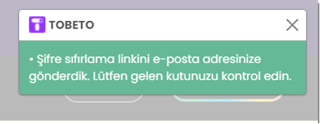
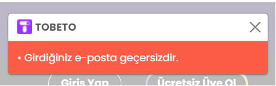

## Test senaryosu : Şifresini unutan kullanıcının ve kullanıcı olmayan kişinin şifresini yenileyebilme işlemi test edilecektir. 
#### Açıklama: Kullanıcının geçerli veya geçersiz e-postalar ile şifresini yenileyebilmesi durumu kontrol edilecektir.
### Ön koşul: Web ekranında https://tobeto.com/giris sayfası açık olmalıdır.
              
## Test case 1: Kullanıcının kayıtlı e-posta ile şifresini başarılı bir şekilde yenileyebilmesi işlemi test edilecektir
#### Ön Koşul : Kullanıcının sistemde kayıtlı hesabı olmalıdır.
#### Adımlar:  
#### 1. E-posta alanını doldurun
####  sirakaya.seymaa@gmail.com (kayıtlı e_posta hesabı)
#### 2. Gönder butonuna tıklayın.
#### Beklenen Sonuç : Kullanıcı ‘Şifre sıfırlama linkini e-posta adresinize gönderdik. Lütfen gelen kutunuzu kontrol edin.’ uyarısı almalıdır.

## Test case 2: Kullanıcının kayıtlı olmayan e-posta ile şifre yenileme işlemi test edilmeye çalışılacaktır.
#### Ön Koşul : E-Posta formatına uygun bir mail adresi bulunmalıdır.
#### Adımlar:  
#### 1. E-posta alanını doldurun
####  111@gmail.com (kayıtlı olmayan e_posta hesabı)
#### 2. Gönder butonuna tıklayın.
#### Beklenen Sonuç : Kullanıcı ‘Şifre sıfırlama linkini e-posta adresinize gönderdik. Lütfen gelen kutunuzu kontrol edin.’ uyarısı almalıdır.

## Test case 3: Kullanıcının geçersiz e-posta ile şifresinin yenileyememe işlemi test edilecektir.
#### Adımlar:
#### 1. E-posta alanını doldurun
####  Input: gmail123 (geçersiz e_posta hesabı)
#### 2. Gönder butonuna tıklayın.
#### Beklenen Sonuç: Kullanıcı ‘Girdiğiniz e-posta geçersizdir.’ uyarısı almalıdır.

## PYTEST KONTROLÜ 

 

 
