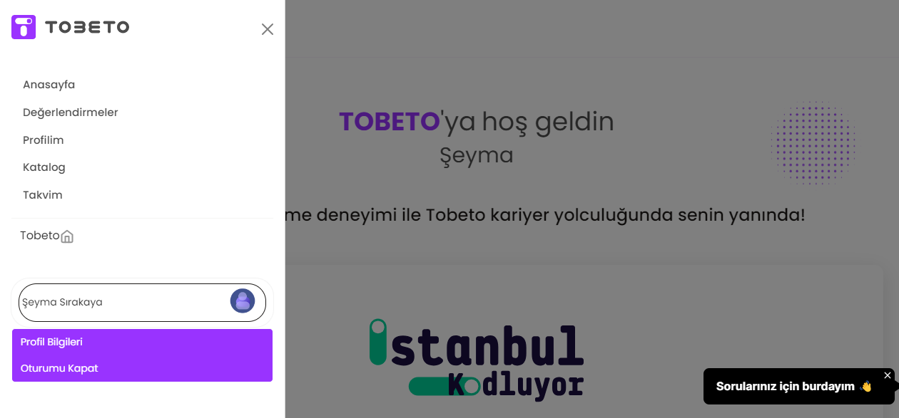
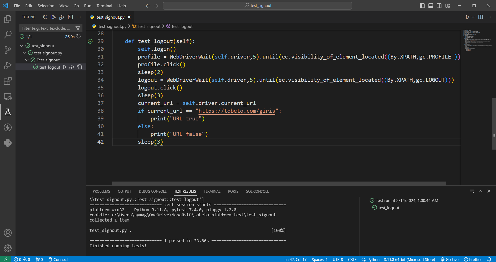

## Test Senaryosu : Kullanıcının ooturumu kapatabilmesi kontrol edilecektir.
#### Ön Koşul : Kullanıcının tobeto platforma giriş yapmış olması gerekmektedir.

## Test Case 1: Kullanıcının çıkış yapması test edilecektir.
#### Adımlar:
#### 1- Kullanıcı menü ikonına tıklayın.
#### 2- İsminin alt kısmında oturumu kapat butonuna tıklayın.
#### Beklenen Sonuç: Kullanıcı oturumu kapatmış olmalı ve https://tobeto.com/giris sayfasına yönlendirilmelidir. 

## PYTEST KONTROLÜ 

